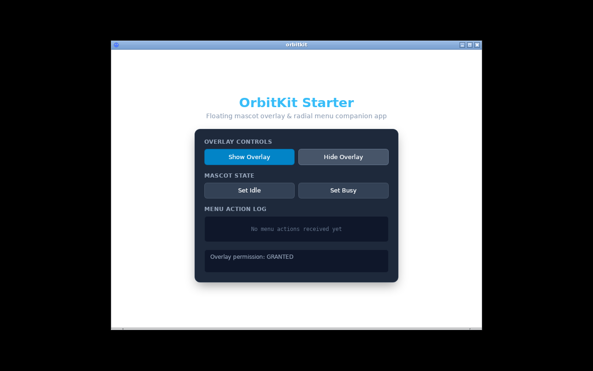
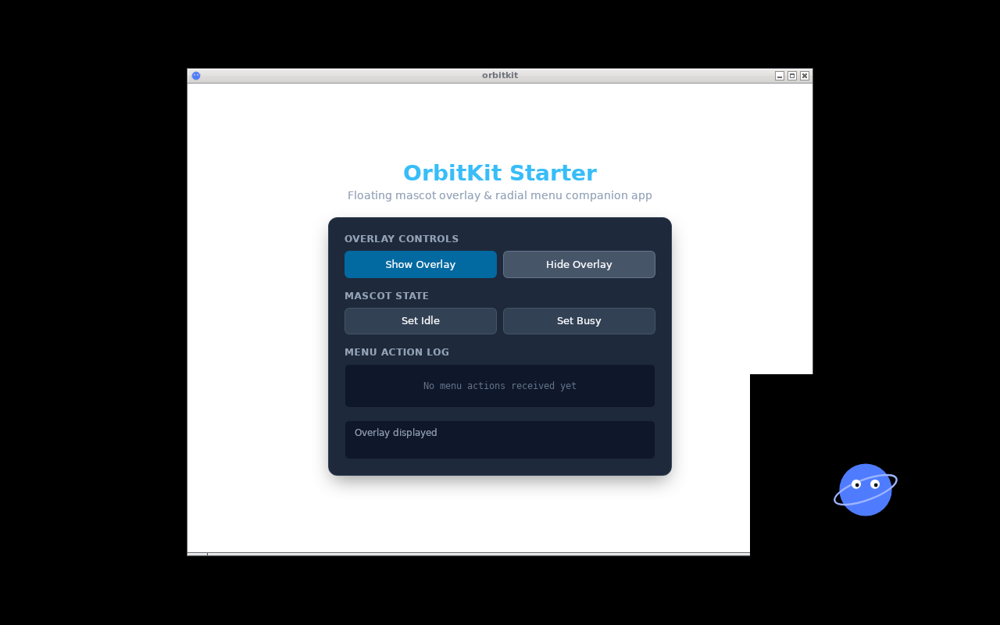
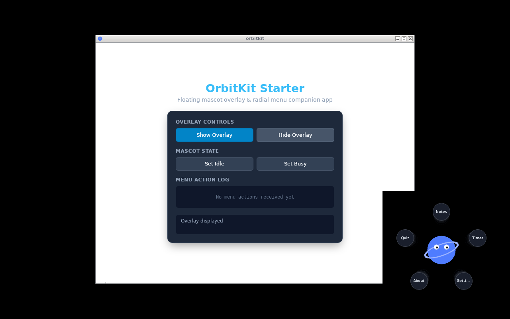
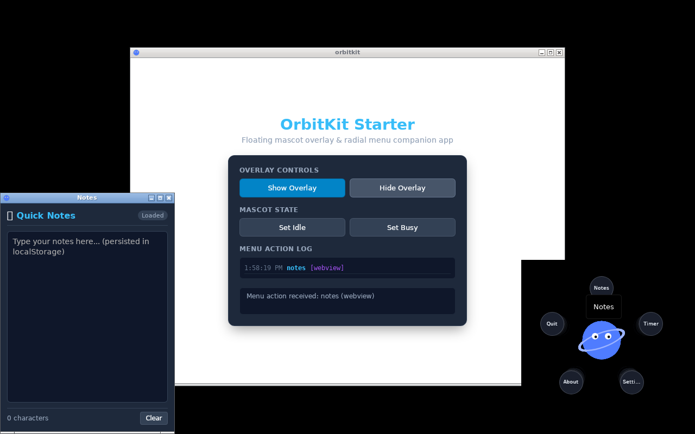

# OrbitKit

OrbitKit is a domain-neutral shell SDK for building desktop and mobile companion applications with [Tauri v2](https://v2.tauri.app) and [Svelte 5](https://svelte.dev). It provides a floating, replaceable mascot, an interactive radial action menu, and auxiliary popup windows or native system overlays.

---

## Screenshots

| 1. Main Window | 2. Mascot Overlay |
|---|---|
|  |  |
| **3. Radial Action Menu** | **4. Auxiliary Popup Window** |
|  |  |

---

## Features

- **Cross-Platform Shell**:
  - **Desktop (Linux, macOS, Windows)**: Frameless, transparent floating mascot window (`orbitkit-mascot`) and dynamic popup windows (`orbitkit-popup-*`).
  - **Android**: Native system overlay (`TYPE_APPLICATION_OVERLAY`) rendered over third-party applications via `SYSTEM_ALERT_WINDOW`.
- **Replaceable Mascot**:
  - **SVG Sandbox (K3-A3)**: Inline SVG markup rendered securely as `` data URLs to prevent script execution and mXSS.
  - **CSS Sprite Sheets**: Frame-based horizontal strip animations with FPS control, looping, row indexing, and OS reduced-motion detection.
  - **Static Images**: Standard PNG, WebP, or SVG graphics.
- **Configurable Radial Menu**:
  - Arc or full 360-degree circular layout for 1 to 12 items.
  - Math-driven placement using `layoutItems` geometry.
  - Interaction modes: click-to-activate or hover-to-activate.
- **Direct JNI Survival (Android)**:
  - Native overlay taps dispatch directly to Rust via JNI (`OrbitkitJniBridge.onNativeAction`).
  - Menu actions execute reliably even when the Chromium WebView is throttled or suspended in the background.
- **Minimal Core Permissions**:
  - Core plugin requires only `SYSTEM_ALERT_WINDOW` on Android and zero elevated permissions on desktop.
  - Sensitive features (such as microphone capture) are decoupled into modular extensions (`tauri-plugin-orbitkit-recorder`).

---

## Quickstart (≤ 10 Commands)

To clone, build, and verify the OrbitKit workspace from scratch:

```bash
# 1. Install workspace dependencies
pnpm install --frozen-lockfile

# 2. Build TypeScript packages and components
pnpm -r build

# 3. Typecheck workspace packages
pnpm -r check

# 4. Run Vitest component and bridge tests
pnpm -r test

# 5. Typecheck Rust plugin crates (host check)
cargo check --workspace --exclude starter

# 6. Compile starter desktop app inside Linux container
scripts/linux-desktop.sh build examples/starter
```

> **Note on Desktop Compilation**: Host compilation of Linux desktop binaries requires `webkit2gtk-4.1`. OrbitKit provides `scripts/linux-desktop.sh` to compile and test the desktop application inside a reproducible Docker container without requiring local WebKitGTK packages.

---

## Platform Support Matrix

| Platform | Mascot Window | Radial Menu | Auxiliary Popups | Permissions Required | Test Status |
|---|---|---|---|---|---|
| **Linux** | Frameless transparent webview (`orbitkit-mascot`) | Svelte 5 component | Native `WebviewWindow` | None (requires X11 compositor or Wayland) | Verified via `scripts/linux-desktop.sh` container runner |
| **macOS** | Frameless transparent webview | Svelte 5 component | Native `WebviewWindow` | `macOSPrivateApi: true` for transparency | Verified via GitHub Actions CI matrix |
| **Windows** | Frameless transparent webview | Svelte 5 component | Native `WebviewWindow` | None (requires Microsoft WebView2) | Verified via GitHub Actions CI matrix |
| **Android** | Native `WindowManager` overlay | Native Kotlin canvas arc | Unsupported on mobile (`open_popup` returns `unsupported`) | `SYSTEM_ALERT_WINDOW` | Verified via Gradle JUnit suites & JNI tests; on-device physical execution **DEFERRED** |

### Android Gate B Notice

> **Limitation**: **"overlay cannot cold-start mic FGS"**
>
> Under Android 14+ (API 34) and Android 16 While-In-Use Gate B restrictions, microphone foreground services (`FOREGROUND_SERVICE_TYPE_MICROPHONE`) cannot be cold-started while an application is backgrounded.
>
> Because an overlay window (`TYPE_APPLICATION_OVERLAY`) does not grant visible Activity focus or Top Activity state, cold-starting microphone capture from an overlay button throws `ForegroundServiceStartNotAllowedException` / `SecurityException`.
>
> The microphone service must be started while the application's Activity is in the visible foreground (or initiated via a standby notification action `PendingIntent`). Once started, the overlay can pause, resume, and stop the service without restriction.

---

## Workspace Structure

- [`packages/orbitkit`](packages/orbitkit): `@orbitkit/ui` Svelte 5 + TypeScript library.
- [`crates/tauri-plugin-orbitkit`](crates/tauri-plugin-orbitkit): Core Tauri v2 plugin and Android library module.
- [`crates/tauri-plugin-orbitkit-recorder`](crates/tauri-plugin-orbitkit-recorder): Optional audio recording and foreground service extension.
- [`examples/starter`](examples/starter): Complete runnable starter application.
- [`scripts/linux-desktop.sh`](scripts/linux-desktop.sh): Containerized build and Xvfb screenshot runner.

---

## Documentation

- [Getting Started](docs/getting-started.md) — Integrating OrbitKit into an existing Tauri v2 app.
- [Configuration Reference](docs/configuration.md) — Complete schema documentation for K2 configuration.
- [API Reference](docs/api.md) — TypeScript and Rust API contracts, commands, and error codes.
- [Architecture](docs/architecture.md) — Cross-platform design, IPC, and JNI bridge.
- [Android Platform Guide](docs/platforms/android.md) — Permissions, SAW lifecycle, and JNI survival.
- [Desktop Platform Guide](docs/platforms/desktop.md) — Multi-window, Linux compositors, and container runner.
- [macOS Platform Guide](docs/platforms/macos.md) — Transparency private API and entitlements.
- [Windows Platform Guide](docs/platforms/windows.md) — WebView2 and high-DPI scaling.
- [Extension Guide](docs/extensions.md) — Writing modular extensions (audio recorder reference).
- [Development & CI Guide](docs/development.md) — Workspace scripts, dev-only env hooks, and CI workflows.
- [Changelog](CHANGELOG.md) — Release notes and version history.

---

## License

TBD — no license has been chosen yet (owner decision pending).
