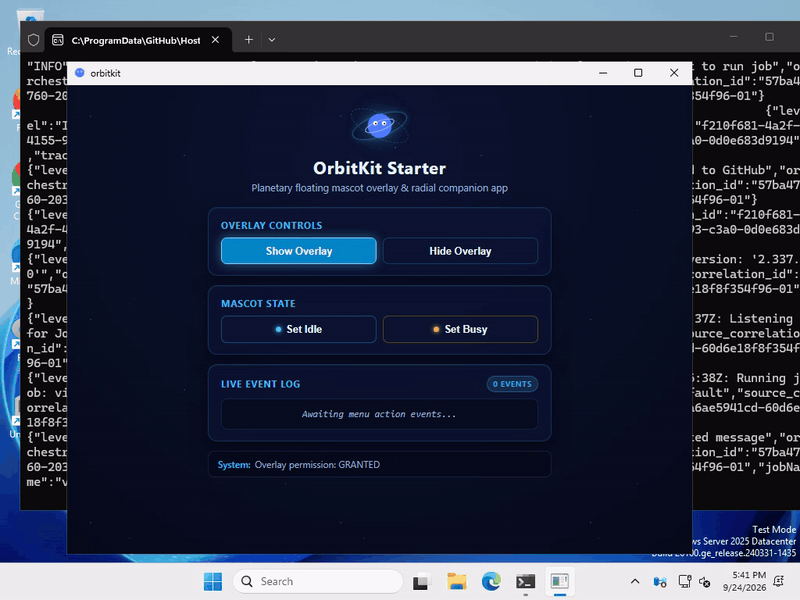

<div align="center">


# OrbitKit

**A floating mascot + radial menu SDK for Tauri v2: configure once, run on Windows, macOS, Linux, and Android.**

[](https://github.com/megastruktur/orbitkit/actions/workflows/ci.yml)
[](LICENSE)
[](https://v2.tauri.app)
[](#platform-support-matrix)

</div>

---

<div align="center">



</div>

---

## Features

| Feature | Description |
|---|---|
| **Unified K2 Configuration** | Configure mascot visuals, radial action menus, and popup targets once in `orbitkit.config.json` for all target platforms. |
| **Reactive Mascot States** | Seamlessly toggle between `idle`, `busy`, and custom states. Supports sandboxed inline SVG data URLs, CSS sprite sheets, or static images. |
| **Radial Menu Geometry & Animation** | Full circular `orbit` (360°) or directional `arc` (top, bottom, left, right) layouts with animated `spawn` / `none` radial transitions. |
| **Vector Icon Action Discs** | Radial menu action items render sharp vector icons decoded directly from SVG data URLs, complete with labels and tooltips. |
| **Adaptive Cross-Platform Popups** | Multi-window desktop popups via native `WebviewWindow` instances, adapting to a mobile bottom sheet (`PopupSheet`) on Android. |
| **Draggable Desktop Mascot** | Fluid desktop window dragging via `startMascotDrag` while preserving click-to-activate radial menu interactions. |
| **Native Android System Overlay** | Floating `TYPE_APPLICATION_OVERLAY` running outside the app with direct JNI action dispatch (`OrbitkitJniBridge.onNativeAction`). |
| **Typed TypeScript & Rust Bridge** | Pure Svelte 5 `@orbitkit/ui` package with a typed config (`defineConfig`), runtime schema validation (`validateConfig`) and safe Tauri IPC wrappers. |

---

## Quickstart (≤ 6 Commands)

To clone, build, and verify the OrbitKit workspace from scratch:

```bash
# 1. Install workspace dependencies
pnpm install --frozen-lockfile

# 2. Build TypeScript packages and components
pnpm -r build

# 3. Typecheck workspace packages
pnpm -r check

# 4. Run Vitest component and bridge tests
pnpm -r test

# 5. Typecheck Rust plugin crates
cargo check --workspace --exclude starter

# 6. Compile starter desktop app inside Linux container
scripts/linux-desktop.sh build examples/starter
```

> **Note on Desktop Compilation**: Host compilation of Linux desktop binaries requires `webkit2gtk-4.1`. OrbitKit provides `scripts/linux-desktop.sh` to compile and test the desktop application inside a reproducible Docker container without requiring local WebKitGTK packages.

---

## Configuration

OrbitKit applications are declared using a single, type-checked configuration file (`orbitkit.config.json` or TypeScript `defineConfig`). The excerpt below demonstrates a reactive SVG mascot with `idle` and `busy` states, a top-anchored radial arc menu with spawn animation and an SVG icon, and a linked auxiliary popup:

```json
{
  "mascot": {
    "kind": "svg",
    "src": "<svg width=\"160\" height=\"160\" viewBox=\"0 0 160 160\" xmlns=\"http://www.w3.org/2000/svg\"><circle cx=\"80\" cy=\"80\" r=\"56\" fill=\"#4f7cff\" /><circle cx=\"60\" cy=\"68\" r=\"10\" fill=\"#ffffff\" /><circle cx=\"100\" cy=\"68\" r=\"10\" fill=\"#ffffff\" /></svg>",
    "size": 96,
    "initialState": "idle",
    "states": {
      "idle": {
        "src": "<svg width=\"160\" height=\"160\" viewBox=\"0 0 160 160\" xmlns=\"http://www.w3.org/2000/svg\"><circle cx=\"80\" cy=\"80\" r=\"56\" fill=\"#4f7cff\" /></svg>"
      },
      "busy": {
        "src": "<svg width=\"160\" height=\"160\" viewBox=\"0 0 160 160\" xmlns=\"http://www.w3.org/2000/svg\"><circle cx=\"80\" cy=\"80\" r=\"56\" fill=\"#f59e0b\" /></svg>"
      }
    }
  },
  "menu": {
    "layout": "arc",
    "arc": {
      "position": "top",
      "span": 180
    },
    "animation": "spawn",
    "radius": 96,
    "startAngle": -180,
    "endAngle": 0,
    "items": [
      {
        "id": "notes",
        "label": "Notes",
        "icon": "data:image/svg+xml;base64,PHN2ZyB4bWxucz0iaHR0cDovL3d3dy53My5vcmcvMjAwMC9zdmciIHdpZHRoPSIyNCIgaGVpZ2h0PSIyNCIgdmlld0JveD0iMCAwIDI0IDI0IiBmaWxsPSJub25lIiBzdHJva2U9IiNFNkY2RkYiIHN0cm9rZS13aWR0aD0iMiI+PHBhdGggZD0iTTE0IDJ2NWExIDEgMCAwIDAgMSAxaDUiLz48cGF0aCBkPSJNNiAyMmEyIDIgMCAwIDEtMi0yVjRhMiAyIDAgMCAxIDItMmg4YTIuNCAyLjQgMCAwIDEgMS43MDQuNzA2bDMuNTg4IDMuNTg4QTIuNCAyLjQgMCAwIDEgMjAgOHYxMmEyIDIgMCAwIDEtMiAyeiIvPjwvc3ZnPg=="
      }
    ]
  },
  "windows": {
    "popups": [
      {
        "id": "notes",
        "url": "index.html?orbitkit=popup&popup=notes",
        "title": "Notes",
        "width": 360,
        "height": 420,
        "resizable": false,
        "alwaysOnTop": true
      }
    ]
  }
}
```

Config schemas are validated at runtime by `validateConfig` in `@orbitkit/ui` and enforced at compile time with TypeScript interfaces (`OrbitKitConfig`, `MascotConfig`, `MenuConfig`, `WindowsConfig`).

---

## Platform Support Matrix

| Platform | Mascot Overlay | Radial Menu | Auxiliary Popups | Mascot Drag | Icon Items | Verification Status |
|---|---|---|---|---|---|---|
| **Linux** | Frameless transparent window (`orbitkit-mascot`) | Svelte 5 component (`RadialMenu`) | Native `WebviewWindow` | Supported (`startMascotDrag`) | Supported (SVG data URLs) | Verified via `scripts/linux-desktop.sh` container runner and CI |
| **Windows** | Frameless transparent window via WebView2 | Svelte 5 component (`RadialMenu`) | Native `WebviewWindow` | Supported (`startMascotDrag`) | Supported (SVG data URLs) | Built in the GitHub Actions CI matrix and manually verified on Windows 11 (debug and release); see [Windows console note](#windows-console-note) |
| **macOS** | Frameless transparent window (`macOSPrivateApi: true`) | Svelte 5 component (`RadialMenu`) | Native `WebviewWindow` | Supported (`startMascotDrag`) | Supported (SVG data URLs) | Untested locally ("should work"); verified via CI compile matrix (see [macOS Platform Guide](docs/platforms/macos.md)) |
| **Android** | Native `WindowManager` overlay (`TYPE_APPLICATION_OVERLAY`) | Native Kotlin views (orbit/arc) | In-app bottom sheet (`PopupSheet`) | Native touch drag | Supported (SVG data URLs via native `SvgDrawable`; PNG/JPEG/WebP via BitmapFactory) | Verified via Gradle JUnit suites and on a physical device (Samsung Z Flip 7) |

### Windows Console Note

On Windows, debug binaries (`tauri build --debug` and `tauri dev`) intentionally display an attached console window for stdout/stderr diagnostics. Production release builds (`pnpm tauri build`) suppress this window using `#![cfg_attr(not(debug_assertions), windows_subsystem = "windows")]` in `main.rs`. For details and project configuration, see the [Windows Platform Guide: Console Window in Debug Builds](docs/platforms/windows.md#console-window-in-debug-builds).

### Android Gate B Notice

> **Limitation**: **"overlay cannot cold-start mic FGS"**
>
> Under Android 14+ (API 34) and Android 16 While-In-Use Gate B restrictions, microphone foreground services (`FOREGROUND_SERVICE_TYPE_MICROPHONE`) cannot be cold-started while an application is backgrounded.
>
> Because an overlay window (`TYPE_APPLICATION_OVERLAY`) does not grant visible Activity focus or Top Activity state, cold-starting microphone capture from an overlay button throws `ForegroundServiceStartNotAllowedException` / `SecurityException`.
>
> The microphone service must be started while the application's Activity is in the visible foreground (or initiated via a standby notification action `PendingIntent`). Once started, the overlay can pause, resume, and stop the service without restriction.

---

## Workspace Structure

- [`packages/orbitkit`](packages/orbitkit): `@orbitkit/ui` Svelte 5 + TypeScript library.
- [`crates/tauri-plugin-orbitkit`](crates/tauri-plugin-orbitkit): Core Tauri v2 plugin and Android library module.
- [`crates/tauri-plugin-orbitkit-recorder`](crates/tauri-plugin-orbitkit-recorder): Optional audio recording and foreground service extension.
- [`examples/starter`](examples/starter): Complete runnable starter application.
- [`scripts/linux-desktop.sh`](scripts/linux-desktop.sh): Containerized build, test, and demo recording runner.

---

## Documentation

- [Getting Started](docs/getting-started.md) — Integrating OrbitKit into an existing Tauri v2 app.
- [Configuration Reference](docs/configuration.md) — Complete schema documentation for K2 configuration.
- [API Reference](docs/api.md) — TypeScript and Rust API contracts, commands, and error codes.
- [Architecture](docs/architecture.md) — Cross-platform design, IPC, and JNI bridge.
- [Android Platform Guide](docs/platforms/android.md) — Permissions, SAW lifecycle, and JNI survival.
- [Desktop Platform Guide](docs/platforms/desktop.md) — Multi-window, Linux compositors, and container runner.
- [macOS Platform Guide](docs/platforms/macos.md) — Transparency private API and entitlements.
- [Windows Platform Guide](docs/platforms/windows.md) — WebView2, DPI scaling, and debug console behavior.
- [Extension Guide](docs/extensions.md) — Writing modular extensions (audio recorder reference).
- [Development & CI Guide](docs/development.md) — Workspace scripts, dev-only env hooks, and CI workflows.
- [Changelog](CHANGELOG.md) — Release notes and version history.

---

## Credits

- Vector icons sourced from [Lucide Icons](https://lucide.dev/) (licensed under [MIT](examples/starter/public/icons/LICENSE-lucide.txt)).
- Desktop and mobile application runtime powered by [Tauri](https://v2.tauri.app).

---

## License

[MIT](LICENSE) © 2026 Piotr Varaksin
